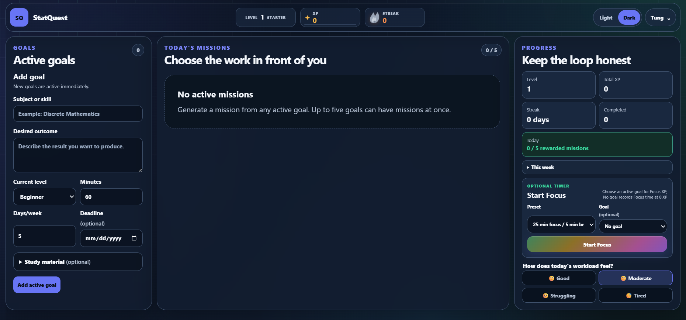
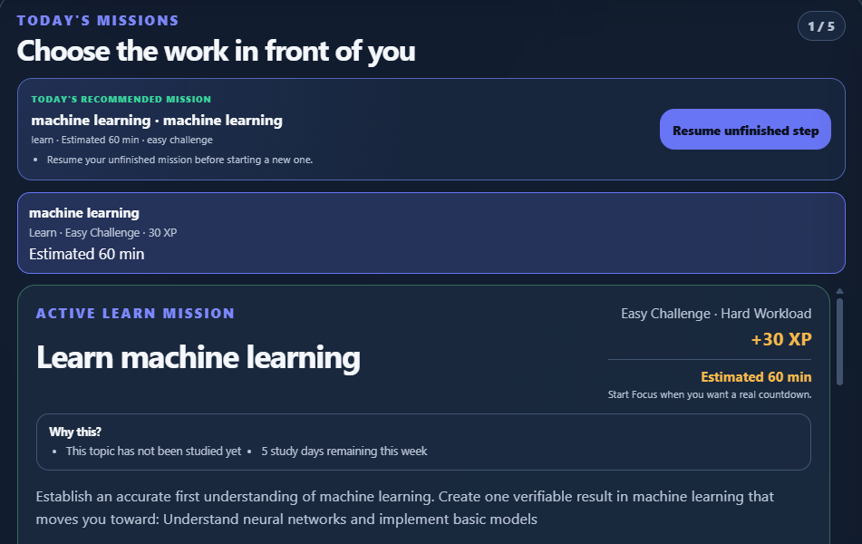
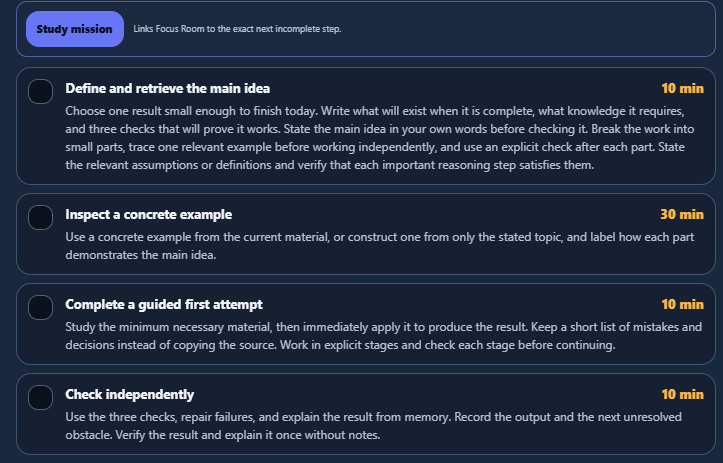
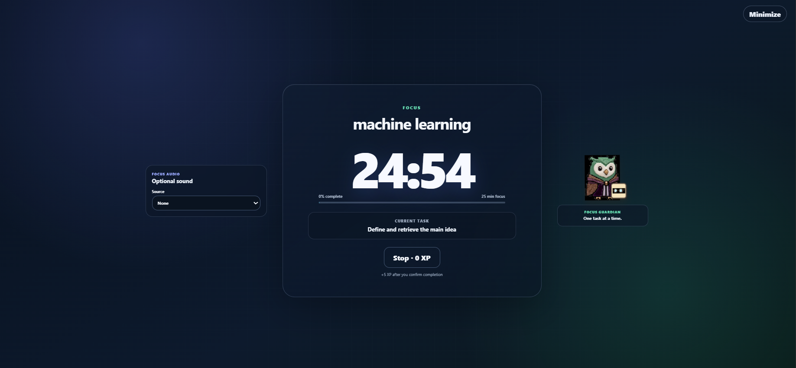

# StatQuest


An AI-assisted statistics learning platform that helps students build statistical intuition through personalized missions, focused learning sessions, and adaptive progress tracking.

StatQuest transforms studying from a passive activity into a structured learning workflow:

```
Goal
 |
Mission Generation
 |
Focused Learning
 |
Progress Tracking
 |
Better Recommendations
```

---

# Live Demo

🚀 Try StatQuest:

https://statquest-azure.vercel.app/

---

# Demo

## Learning Dashboard



The dashboard provides a central learning workspace with:

- active learning goals
- recommended missions
- progress tracking
- focus session access
- learning statistics

---

## Personalized Mission Generation



StatQuest converts learning goals into structured missions.

Each mission includes:

- learning objectives
- estimated duration
- difficulty level
- XP rewards
- actionable learning steps

The system helps answer:

> "What should I study next, and why?"

---

## Mission Execution



Each mission breaks learning into smaller actions:

- understand the main idea
- inspect examples
- complete guided practice
- verify understanding

This encourages active learning instead of passive reading.

---

## Focus Mode



Focus Mode provides a distraction-free learning environment.

Features:

- active learning task
- timer-based sessions
- progress tracking
- completion feedback
- reward system

---

# Overview

Many students struggle with statistics not because concepts are impossible, but because they lack:

- a clear learning path
- personalized feedback
- consistent review habits
- structured practice

StatQuest addresses this by creating a learning system that adapts to:

- learning goals
- study progress
- completed missions
- review needs
- uploaded materials

The platform creates a continuous improvement loop:

```
Learn
 |
Practice
 |
Measure Progress
 |
Adjust Future Learning
```

---

# Features

## Personalized Learning Missions

StatQuest generates structured missions based on:

- current goals
- learning progress
- topic mastery
- review requirements

Mission types include:

- learning new concepts
- reviewing weak areas
- practicing previous knowledge
- reinforcing understanding

---

## Focus Learning Mode

A dedicated environment designed for deep work.

Features:

- focused study sessions
- timer-based learning
- progress tracking
- completion evidence
- learning streaks

The system separates:

- time spent studying
- actual learning progress
- task completion

to avoid rewarding superficial activity.

---

## Learning Progress System

StatQuest tracks:

- completed missions
- mastery progress
- learning streaks
- XP progression
- review history

The system uses deterministic rules to keep recommendations predictable and explainable.

---

## Document Understanding

Students can provide learning materials.

Supported processing:

- PDF extraction
- DOCX parsing
- OCR text recognition

Future versions can use extracted information for more personalized recommendations.

---

# Technology Stack

## Frontend

- Next.js 16
- React
- TypeScript
- Tailwind CSS

## Application Logic

- Deterministic learning engine
- Mission generation system
- Progress tracking system
- Local state management

## File Processing

- PDF.js
- Mammoth
- Tesseract.js

## Quality

- ESLint
- Node test runner
- GitHub Actions CI

---

# Architecture

Current MVP architecture:

```
User
 |
Next.js Application
 |
Learning Engine
 |
Local Storage
 |
File Processing
```

Future production architecture:

```
Client
 |
Next.js API Layer
 |
Backend Services
 |
PostgreSQL Database
 |
Background Workers
 |
Analytics Pipeline
```

Detailed documentation:

- `docs/architecture/overview.md`
- `docs/architecture/decisions.md`

---

# Engineering Highlights

## Deterministic Learning Engine

Instead of generating random recommendations, StatQuest uses rule-based decision making.

Responsibilities:

- prioritize missions
- schedule reviews
- update mastery
- calculate rewards

Benefits:

- predictable behavior
- easier debugging
- easier testing
- explainable recommendations

---

## Testing Strategy

The project includes automated tests covering:

- mission generation
- learning progression
- review scheduling
- state migration
- Focus Mode behavior
- profile management
- file processing

Current status:

```
149 tests passed
0 failed
```

---

## Continuous Integration

Every change is validated through GitHub Actions:

```
Install Dependencies
        |
Type Checking
        |
Linting
        |
Automated Tests
        |
Production Build
```

This prevents broken code from reaching the main branch.

---

# Deployment

StatQuest is deployed using Vercel.

Deployment workflow:

```
GitHub Repository
        |
        v
Vercel Build
        |
        v
Production Deployment
```

Production URL:

https://statquest-azure.vercel.app/

---

# Getting Started

## Requirements

- Node.js 22+
- npm

---

## Installation

Clone the repository:

```bash
git clone https://github.com/thanhtungnguyen-dev/statquest.git

cd statquest
```

Install dependencies:

```bash
npm install
```

Start development server:

```bash
npm run dev
```

Open:

```
http://localhost:3000
```

---

# Available Commands

Development:

```bash
npm run dev
```

Production build:

```bash
npm run build
```

Start production server:

```bash
npm run start
```

Lint:

```bash
npm run lint
```

Type checking:

```bash
npm run typecheck
```

Run tests:

```bash
npm test
```

---

# Roadmap

## Completed

- Personalized mission system
- Focus learning mode
- Progress tracking
- File processing
- Learning state migration
- Automated testing
- CI pipeline
- Product documentation
- Live deployment

## Future Improvements

- User authentication
- Cloud synchronization
- PostgreSQL backend
- AI tutoring assistant
- Advanced learning analytics
- Collaborative learning features

---

# Security

Current version is a local-first MVP.

Security considerations:

- No sensitive user information should be stored insecurely
- File processing is performed locally
- Authentication is not implemented yet

Future improvements:

- secure authentication
- server-side validation
- database access control
- encrypted user data storage

---

# Author

Thanh Tung Nguyen

Computer Science Student

Interested in:

- Software Engineering
- Artificial Intelligence
- Learning Technologies

---

# License

This project is developed for educational and portfolio purposes.